# PetLens 🐾

面向宠物家庭的多模态物品安全决策助手。通过文字描述、图片上传或手机系统拍照入口识别物品，并结合宠物画像给出结构化风险评估、处置建议和紧急信号。

> PetLens 用于日常风险筛查，不能替代兽医诊断。若宠物已经误食或出现异常，请立即联系兽医。

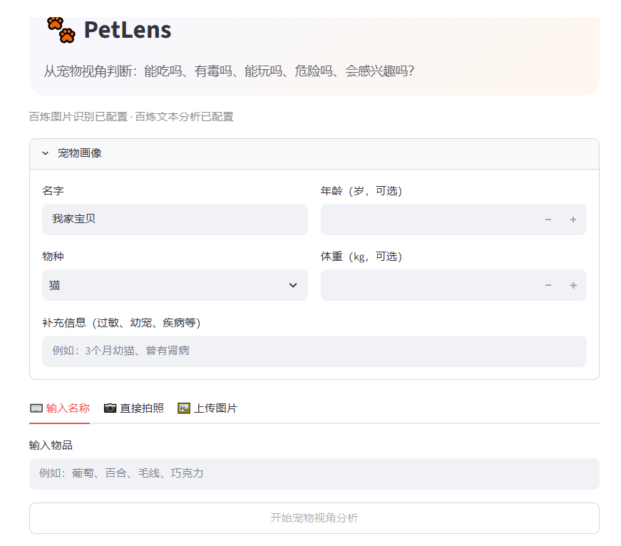

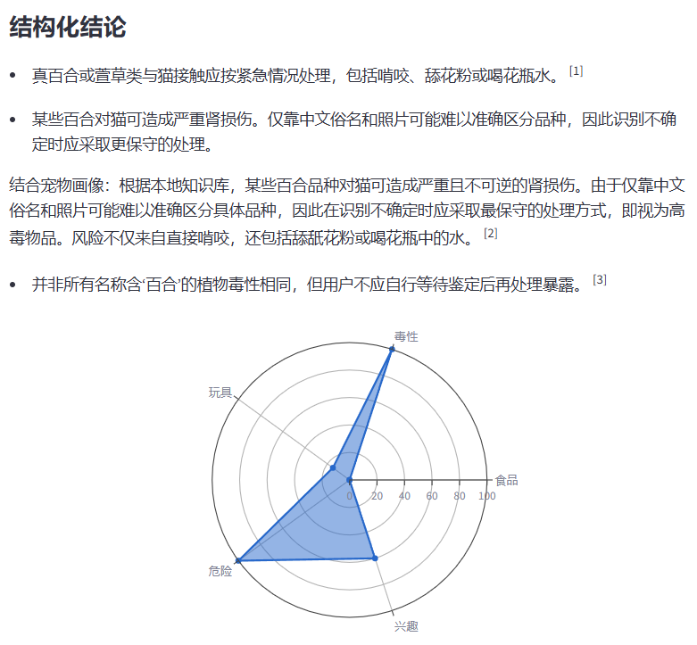

## 功能亮点

- 宠物画像：记录物种、年龄、体重和健康或行为备注。
- 多模态输入：支持文字、图片上传，以及手机浏览器的系统相册或拍照入口。
- 物品识别：输出标准物品名称、置信度、客观描述、OCR 文本和候选名称。
- 个性化评估：结合宠物画像、本地知识库和可选模型推理生成风险结论。
- 结构化结果：固定 JSON 结构，包含风险等级、五维评分、证据、建议、例外情况和紧急信号。
- 本地历史：使用 SQLite 保存查询结果，支持回看最近记录。

## 工作流程

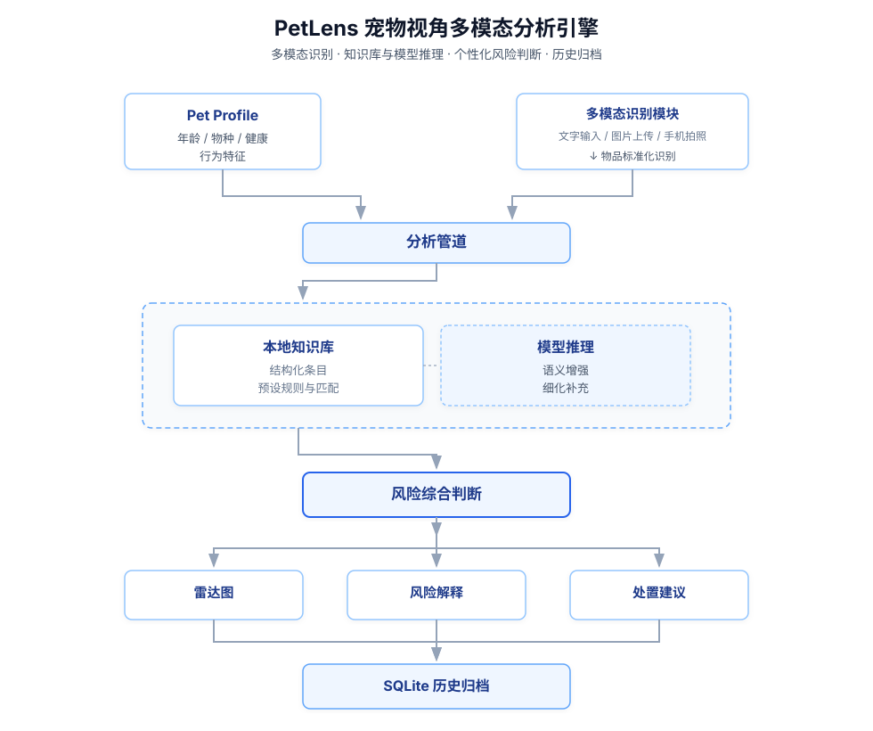

输入先经过识别模块得到标准物品名称，再由分析管道匹配本地知识库，并按配置调用模型补充推理。宠物画像作为上下文参与判断；最终结果经 Pydantic 模型校验后，由前端渲染为风险等级、五维雷达图、解释和行动建议，并写入本地历史记录。

## 核心实现

### 多模态识别

图片识别结果包含物品名称、置信度、客观描述、可见文字和候选名称，便于在不确定时保留可追溯信息。实现位于 `app/llm.py` 和 `app/pipeline.py`。

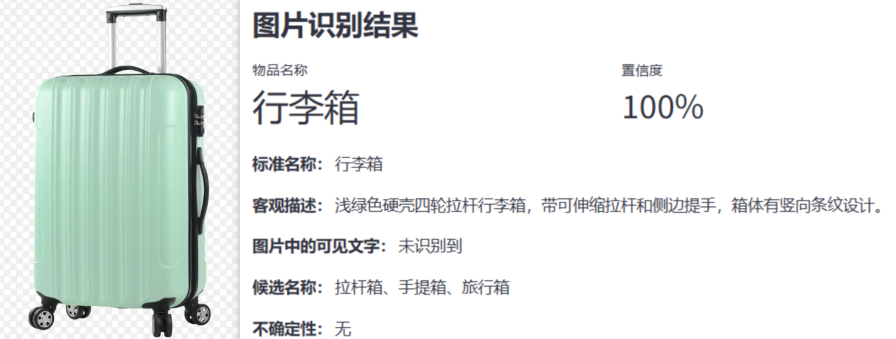

### 个性化风险评估

宠物的年龄、物种、体重和补充信息会与识别结果一并进入分析流程。相同物品面对不同年龄或行为特征的宠物，可以得到不同的风险关注点。

| 幼猫画像 | 老年猫画像 |
|---|---|
| 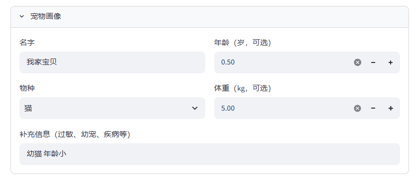 | 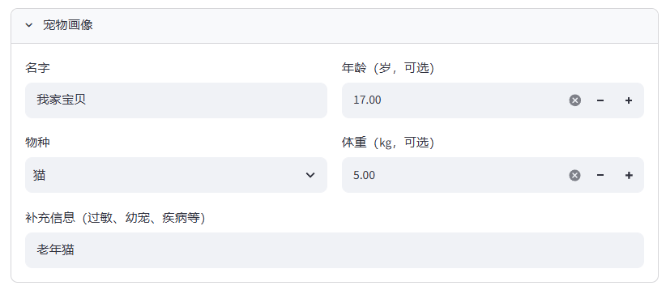 |

| USB 数据线风险结论 A | USB 数据线风险结论 B |
|---|---|
| 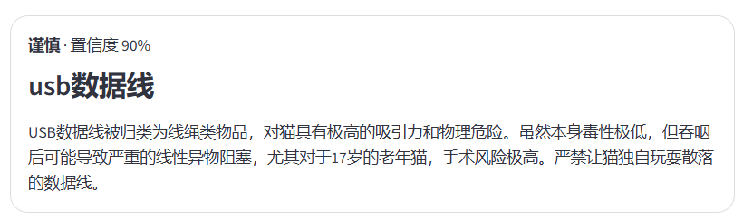 | 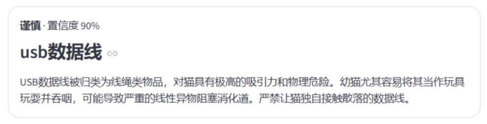 |

### 结构化输出约束

`app/models.py` 使用 Pydantic 约束风险等级、五维评分、结论、建议、紧急信号，以及 claim-evidence 证据关系。模型返回内容必须通过结构校验，前端才能稳定渲染，历史数据也可在读取时再次校验。

[查看脱敏的结构化结果示例](examples/assessment-result.json)

### 本地历史存储

每次查询会写入项目根目录的 `petlens.db`。`history` 表保存查询时间、标准物品名、宠物物种、风险等级、置信度，以及完整的结果 JSON 和宠物画像 JSON；当前版本不保存上传图片或图片路径。数据库可能包含宠物画像信息，已由 `.gitignore` 排除，不应提交到公开仓库。

[查看 SQLite 表结构与实现说明](docs/database-schema.md)

## 运行证据

以下截图来自本地和手机端的实际运行验证。

### 宠物档案与输入


### 高风险结果摘要

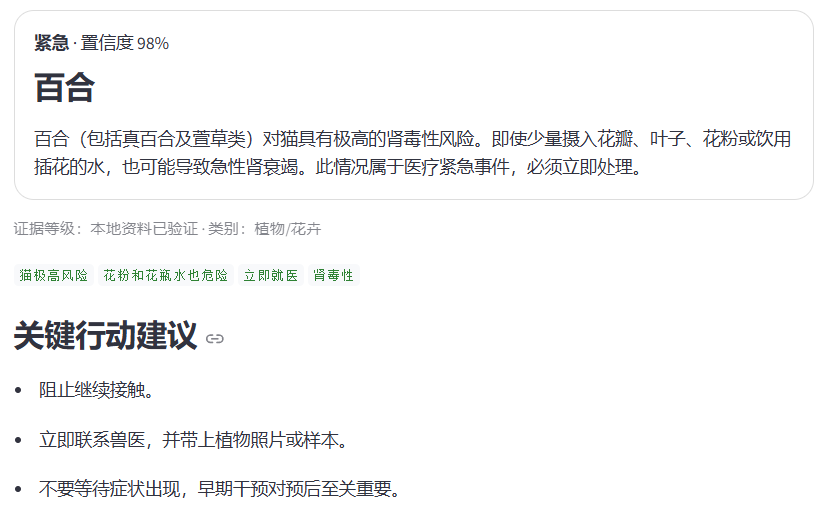

### 普通物品的完整结构化结果

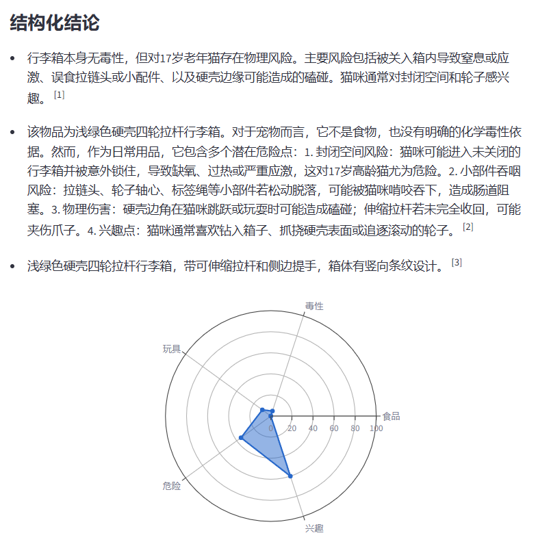

### 手机浏览器访问与拍照上传

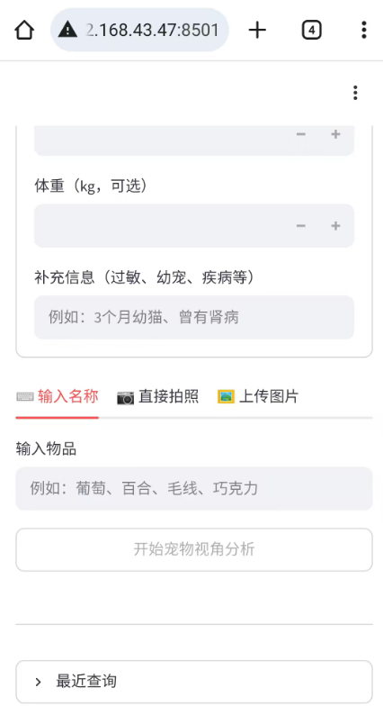

手机与运行 PetLens 的电脑处于同一局域网时，可通过浏览器访问服务，并从相册选择图片或调用系统拍照入口上传。普通局域网 HTTP 地址下，浏览器内嵌的“直接拍照”控件可能受安全上下文限制；系统文件/拍照选择器已完成实际验证。

## 本地运行

推荐在 Windows 10/11 的 WSL2 中运行：

```bash
cd PetLens
python3 -m venv .venv
source .venv/bin/activate
pip install -r requirements.txt
cp .env.example .env
streamlit run streamlit_app.py
```

电脑本机通常访问 `http://localhost:8501`。同一局域网中的手机访问：

```text
http://<电脑的 IPv4 地址>:8501
```

Windows 可用 `ipconfig` 查询电脑当前的 IPv4 地址。热点或路由器重新连接后，地址可能变化。

## 配置

复制 `.env.example` 为 `.env`，按需填写：

| 变量 | 用途 | 示例默认值 |
|---|---|---|
| `DASHSCOPE_API_KEY` | 阿里云百炼 API 密钥 | 留空 |
| `DASHSCOPE_BASE_URL` | OpenAI 兼容接口地址 | `https://dashscope.aliyuncs.com/compatible-mode/v1` |
| `DASHSCOPE_VISION_MODEL` | 图片识别模型 | `qwen3-vl-flash` |
| `DASHSCOPE_TEXT_MODEL` | 文本分析模型 | `qwen3.7-plus` |

不要提交 `.env`、`.streamlit/secrets.toml` 或任何真实密钥。

## 服务管理

项目提供 WSL/Linux 后台服务脚本：

```bash
./scripts/start.sh      # 后台启动
./scripts/status.sh     # 查看进程和网页响应
./scripts/stop.sh       # 停止服务
./scripts/restart.sh    # 重启服务
./scripts/logs.sh       # 查看实时日志（Ctrl+C 退出）
```

服务监听 `0.0.0.0:8501`；日志和 PID 分别写入 `logs/` 与 `run/`，两者均已被 Git 忽略。

## 测试

```bash
pytest -q
```

当前测试结果：`41 passed`。测试覆盖数据模型、claim-evidence 关系、图片识别和文本分析等关键路径。

## 项目结构

```text
PetLens/
├── app/                  # 数据模型、识别、分析、存储和图表
├── data/                 # 本地结构化知识条目
├── docs/                 # 架构图、运行截图与数据库说明
├── examples/             # 脱敏输出示例
├── scripts/              # WSL/Linux 服务管理脚本
├── tests/                # 自动化测试
├── .env.example          # 环境变量模板
├── requirements.txt      # Python 依赖
└── streamlit_app.py      # Streamlit 入口
```

## 已知局限

- 本地结构化知识覆盖仍有限；未命中物品更依赖模型知识与推理能力。
- 当前测试主要保障结构和运行稳定性，尚未完成大规模物品准确率、误报率基准评估。
- 宠物画像目前作为查询上下文使用，尚未形成体重趋势、过敏史时间线等长期健康档案。
- 当前仅验证本机与局域网访问，尚未提供公网部署。

## 开发方式

本项目采用 AI-assisted development：Codex CLI 辅助代码生成、重构与测试；项目负责人完成需求定义、产品机制设计、模型与工具选型、功能验收、异常反馈和迭代决策，并通过自动化测试与实际运行结果逐项验收。
